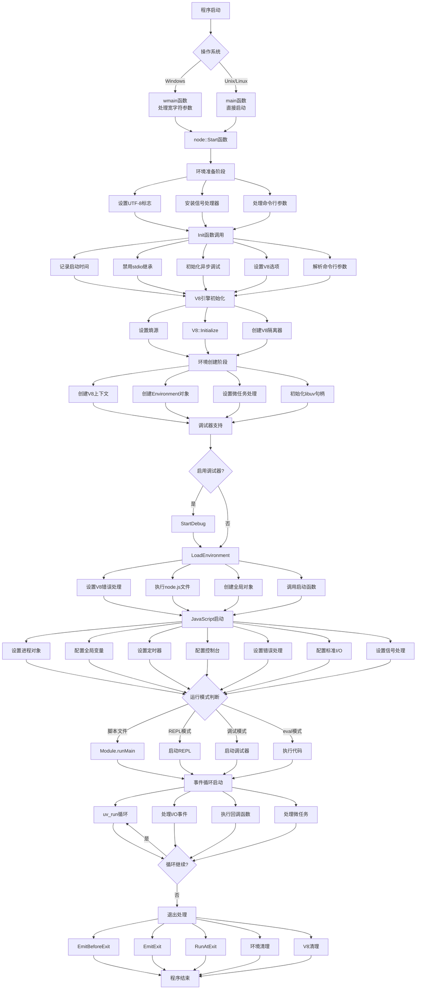
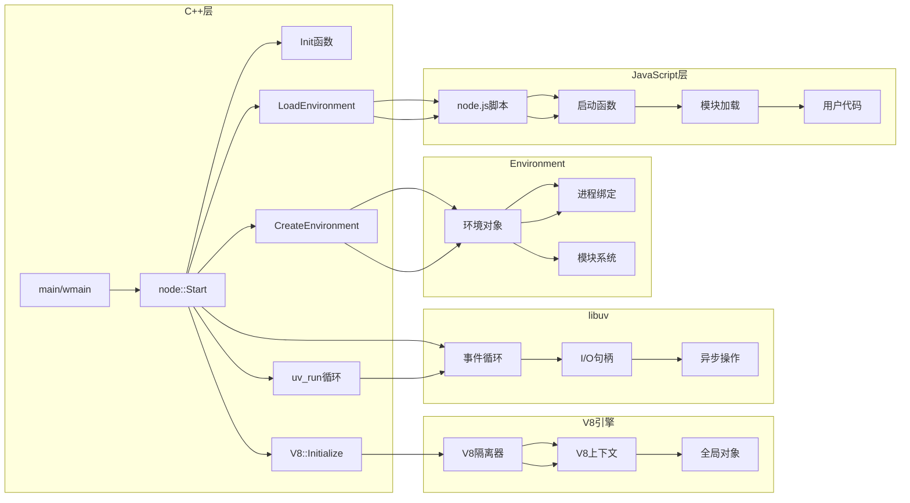
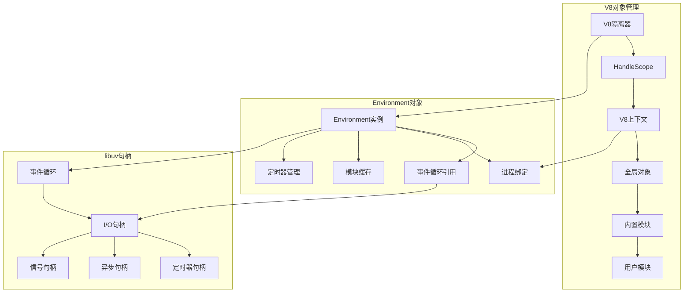
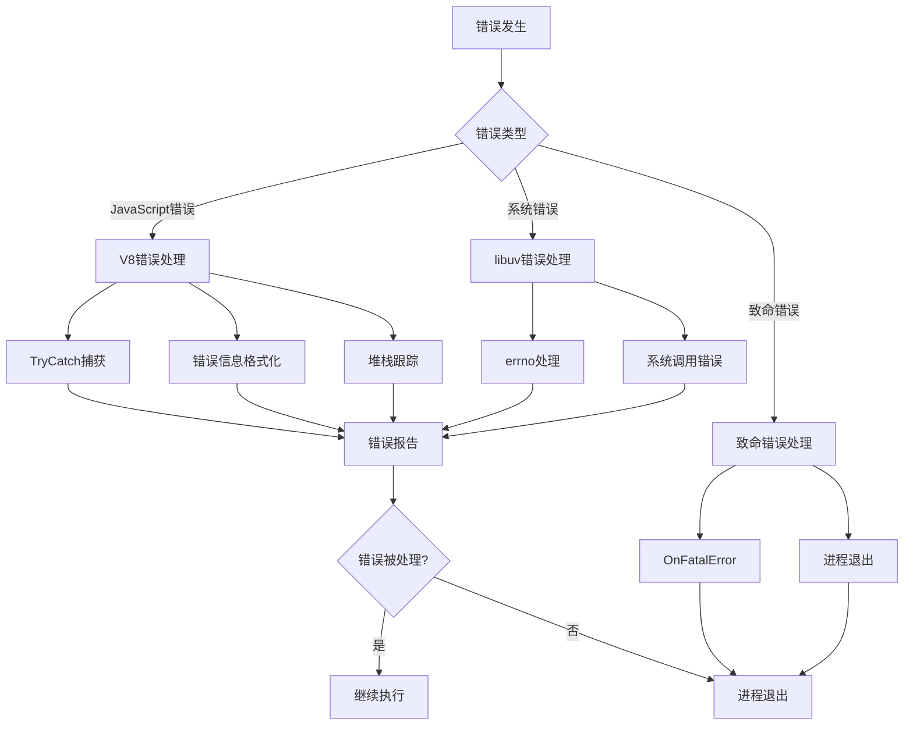

# Node.js v0.12.18 启动流程图

## 主启动流程图



## 详细组件交互图



## 关键函数调用时序图

```mermaid
sequenceDiagram
    participant Main as main/wmain
    participant Start as node::Start
    participant Init as Init
    participant V8 as V8引擎
    participant Create as CreateEnvironment
    participant Load as LoadEnvironment
    participant JS as JavaScript环境
    participant UV as libuv循环
    
    Main->>Start: 调用启动函数
    Start->>Start: 环境准备
    Start->>Init: 初始化参数
    Init->>Init: 解析命令行
    Init->>V8: 设置选项
    Start->>V8: 初始化V8
    V8-->>Start: 初始化完成
    Start->>Create: 创建环境
    Create->>Create: 设置V8上下文
    Create->>Create: 初始化句柄
    Create-->>Start: 环境创建完成
    Start->>Load: 加载JavaScript环境
    Load->>Load: 设置错误处理
    Load->>JS: 执行node.js
    JS->>JS: 启动函数
    JS-->>Load: 启动完成
    Load-->>Start: 加载完成
    Start->>UV: 启动事件循环
    UV->>UV: 处理I/O事件
    UV->>JS: 执行回调
    JS-->>UV: 回调完成
    UV-->>Start: 循环结束
    Start->>Start: 清理资源
    Start-->>Main: 程序结束
```

## 内存和对象管理图



## 错误处理流程



这个流程图展示了 Node.js v0.12.18 的完整启动过程，从程序入口到事件循环运行的全过程。每个阶段都有详细的说明和关键函数调用。

